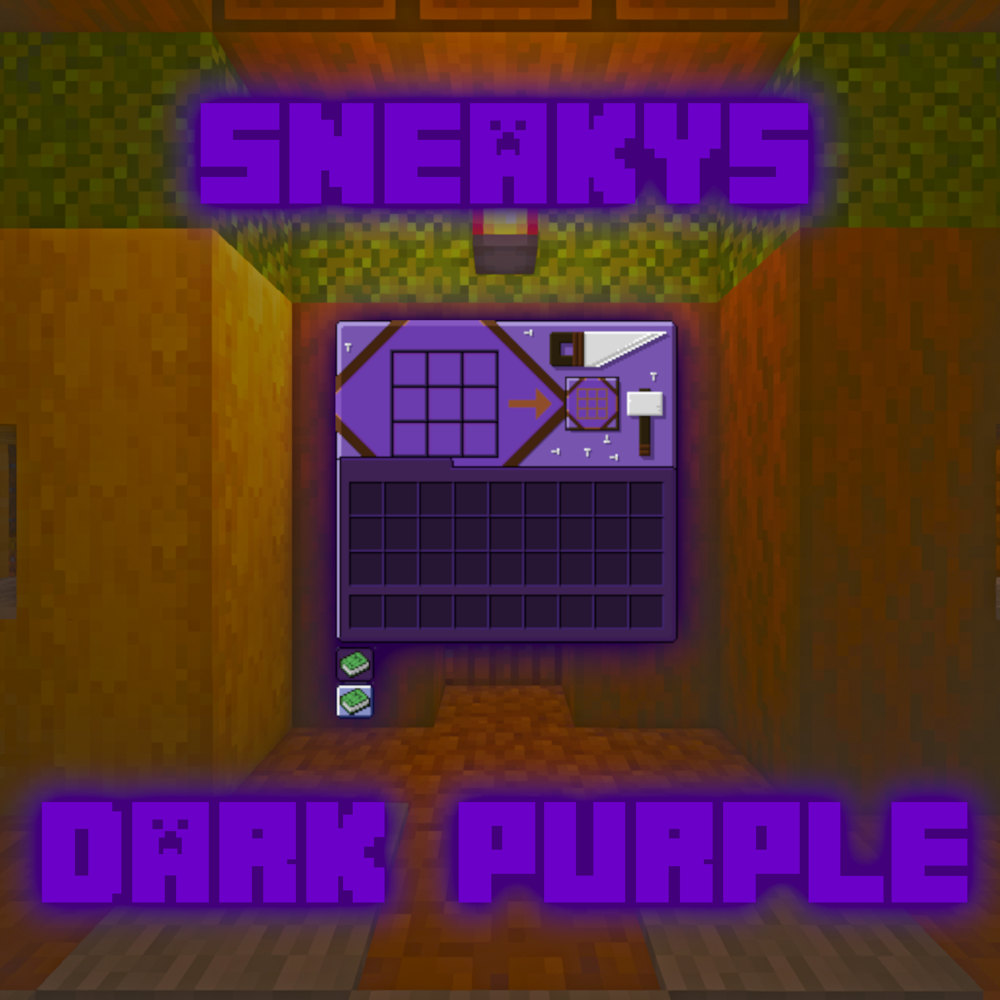

<h2 align="center" style="font-size: 2em;
    text-align: center;
    background: linear-gradient(to right, #8A2BE2, #FF00FF);
    -webkit-background-clip: text;
    background-clip: text;
    -webkit-text-fill-color: transparent;
    text-fill-color: transparent;">Sneakys Dark Purple</h2>

Sneakys Dark Purple is a chill and vibrant dark purple GUI pack that includes custom models, music disc audio, title screen assets and much more! Updates will roll out as time goes by with even more features and changes!

</img>

 

<h5 align=center><b>Make sure you place the "music-dp.zip" archive into ".minecraft\saves\{your_world}datapacks"</b></h5>

 

<h3 align=center><b><a href="https://github.com/Svxy/Sneakys-Dark-Purple/releases/download/v1.1-1.20.1/Sneakys.Dark.Purple.v1.1-1.20.1.zip">Download</a> today!</b></h3>

 
 

<b>Music Disc Songs:</b>

- 21 Savage - see the real
- BabyTron - Emperor of the Universe
- BigKayBreezy x Polo G - Bookbag 2.0
- BigXthaPlug - Back On My BS
- BigXthaPlug - Mmhmm
- BLP Kosher - Special K
- Gunna - whatsapp
- Juice WRLD - Drugs
- Juice WRLD - Feeling
- Juice WRLD - Stay High
- Juice WRLD - Syphilis
- Khalil - Zodiac Killer
- Lil Tecca - Amigo
- Lil Tecca x Juice WRLD - Ransom
- Svaroda - 90mh
- Young Nudy x 21 Savage - Peaches & Eggplants

 

<b>Changes:</b>

> - v1.1 - Added custom sounds for jukebox music disc's (requires datapack)

> - v1.0 - Changed UI component designs for containers, hotbar and inventory etc. also changed title menu assets and design